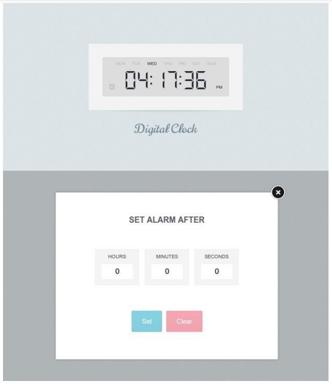

# Lap1
> Create an Image Slider similar to the next image.
 When user press the next button the next image should take the place of the
 current image and current image take the place of the previous image.
 Optional : You can use setInterval to animate the images to give the slide effect.
 like the following example:
 

# lap2
> Lap2
 Create Digital watch like the following with alarm option ( you can use alert dialog
 box to alarm the user instead of sound) 
 like the following example:
 